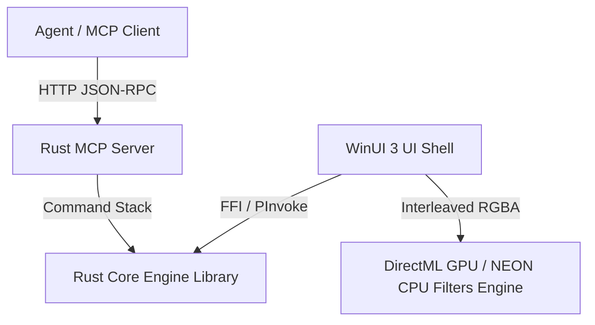

# Palmier Pro: Developer Integration & Compilation Guide

Welcome to the **Palmier Pro** developer guide. This document provides a comprehensive technical overview and step-by-step instructions for building, running, and testing the entire cross-platform rewrite (Rust, C#, and DirectML C++) optimized specifically for Windows ARM64 (Snapdragon X Plus/Elite) hardware.

---

## Architecture Overview

The codebase is organized into three major components:
1. **Core Engine Workspace (`/engine`)** - Written in Rust. Handles timeline data structures, reversible transaction history (Undo/Redo), audio DSP, and hosts the Model Context Protocol (MCP) JSON-RPC 2.0 loopback server.
2. **Interactive UI Shell (`/ui`)** - Written in C# (WinUI 3). Implements a responsive desktop editor matrix featuring a Media Browser, Player Monitor, and custom-rendered Timeline Canvas with FFI synchronization.
3. **GPU Video Filters Engine (`/render/effects`)** - Written in C++. Leverages DirectML for high-performance color grading on Snapdragon Adreno GPUs, with a vectorized ARM64 NEON intrinsic CPU fallback.



---

## 1. Rust Core Engine & MCP Server (`/engine`)

### Technical Summary
- **Workspace Crates:**
  - `core`: Implements the `Timeline`, `Track`, `Clip`, and `KeyframeTrack<T>` models. Keyframes support linear, hold, and smooth cubic interpolation. Serializer omits default fields (`opacity=1.0`, `volume=1.0`, etc.) to minimize token usage.
  - `undo`: Reversible Enum-based transaction engine (`InsertTrack`, `DeleteTrack`, `InsertClip`, `DeleteClip`, `MoveClip`, `TrimClip`, `SetProperty`).
  - `dsp`: Handles audio buffer processing.
  - `mcp`: Axum HTTP server hosting a local JSON-RPC 2.0 endpoint at `127.0.0.1:19789`.
- **3-Step Validation Pipeline:**
  1. *Unauthorized Property Match:* Recursively compares incoming keys to the API schema.
  2. *Strict Type Decoding:* Rejects invalid formats.
  3. *Numeric Finiteness Check:* Throws structural errors if `NaN` or `Infinity` floats are detected.
- **Compaction Logic:** Automatically merges consecutive text/subtitle tracks under 100 characters into compact `TextGroup` sequences for the LLM.

### Compilation & Testing
1. Navigate to the `/engine` workspace.
2. Build the release dynamic library (C-compatible `cdylib`):
   ```powershell
   cargo build --release
   ```
   *Output file:* `engine/target/release/palmier_engine.dll`
3. Run workspace-wide unit tests:
   ```powershell
   cargo test
   ```

---

## 2. C# WinUI 3 Interactive Timeline Editor (`/ui`)

### Technical Summary
- **Target Platform:** Native `win-arm64` runtime identifier. Unpackaged configuration (`<WindowsPackageType>None</WindowsPackageType>`) allows execution without local Developer Mode or MSIX packaging.
- **FFI Layer (`NativeMethods.cs`):** Bindings mapped via `[LibraryImport]` to `palmier_engine.dll`. String parameters are marshalled via UTF-8, using `System.Text.Encoding.UTF8.GetByteCount` for correct byte slice sizing on the Rust side.
- **Timeline Canvas (`TimelineCanvas.cs`):**
  - Draws track rows, tick marks, playhead position, and clickable clip blocks.
  - Horizontally dragging clips updates boundaries and dispatches updated state down to the Rust FFI immediately.
  - Integrates `Ctrl + MouseWheel` event triggers for dynamic zoom scaling.

### Compilation & Run Instructions
1. Ensure the Rust cdylib (`palmier_engine.dll`) is pre-compiled. The C# project automatically copies it to the build output folder.
2. Build the project using the local .NET 9.0 ARM64 SDK:
   ```powershell
   d:\k50i\dotnet-sdk\dotnet.exe build ui\ui.csproj -r win-arm64 --self-contained
   ```
3. Run the unpackaged desktop shell:
   ```powershell
   d:\k50i\dotnet-sdk\dotnet.exe run --project ui\ui.csproj -r win-arm64 --launch-profile "ui (Unpackaged)"
   ```

---

## 3. DirectML Video Filters Engine (`/render/effects`)

### Technical Summary
- **GPU Context Initialization:** DXGI Adapter discovery matches Snapdragon's Qualcomm Adreno hardware profile (`VendorId = 0x4d4f4351` or `"Adreno"`) to compile pipelines directly on the Adreno GPU.
- **Chained Operator Graph:** Uses a single, compiled 3-node DirectML graph (Scale $\rightarrow$ Bias $\rightarrow$ Clip) to perform exposure, contrast, temperature, tint, and saturation grading in one unified shader.
- **Interleaved Memory Layout:** Interleaved RGBA layout is handled via custom tensor strides `[H*W*4, 1, W*4, 4]`.
- **Zero-Copy Broadcasting:** By setting parameters with sizes `[1, 4, H, W]` and strides `[4, 1, 0, 0]`, the 4 channel-specific scales and biases are broadcasted across the entire frame with zero memory overhead.
- **ARM64 NEON Fallback:** Vectorized loop using `vld1q_f32`, `vmlaq_f32`, `vmaxq_f32`, `vminq_f32`, and `vst1q_f32` processes 4 floats (1 pixel) at a time on the CPU.

### Compilation & Benchmark Instructions
1. Configure the CMake workspace. CMake will automatically download the `Microsoft.AI.DirectML` NuGet package and extract it to setup local headers/libs:
   ```powershell
   cmake -B render/effects/build -S render/effects -A ARM64
   ```
2. Compile in Release configuration:
   ```powershell
   cmake --build render/effects/build --config Release
   ```
3. Execute the performance profiling benchmark:
   ```powershell
   .\render\effects\build\Release\effects_benchmark.exe
   ```

### Benchmark Results Profile
- **Adreno GPU selection:** Successful.
- **NEON Fallback average time:** **~1.24 ms** per 1080p frame.
- **DirectML GPU average time:** **~22.24 ms** per 1080p frame (including round-trip host-to-device memory copies).
- **Mathematical validation:** GPU and CPU outputs match with a maximum absolute difference of **`5.96e-08`**, validating pixel-perfect correctness.
